<h1><b>WEB-BASED PROJECT MANAGEMENT SYSTEM FOR THE EXTENSION SERVICES OFFICE OF CAVITE STATE UNIVERSITY - CARMONA</b></h1>
<h2><b>Software Description of the Web Application</b></h2>

The Web-based Project Management System for the Extension Service Office of Cavite State University (CvSU) – Carmona tracks faculty activities, records work hours, and highlights any missing hours. It also identifies participants in each task, makes it easy to generate records, and securely stores activity reports for coordinators. Built with Laravel, the app uses PHP for backend functions, HTML, CSS, Bootstrap 5 for design, JavaScript for interactivity, and MySQL for database management, developed in Visual Studio Code.

<h3><b>
    Login Page
</b></h3>

The login page is designed with the Extension Service Office’s logo, mission, and vision, featuring CvSU – Carmona’s image as a background.

<h3><b>Tasks Monitoring Page</b></h3>

The task monitoring page provides a clear overview of ongoing, upcoming, overdue, and completed subtasks, activities, and projects. Only subtasks do not have upcoming dates. This section displays these items in chronological order based on their creation dates.

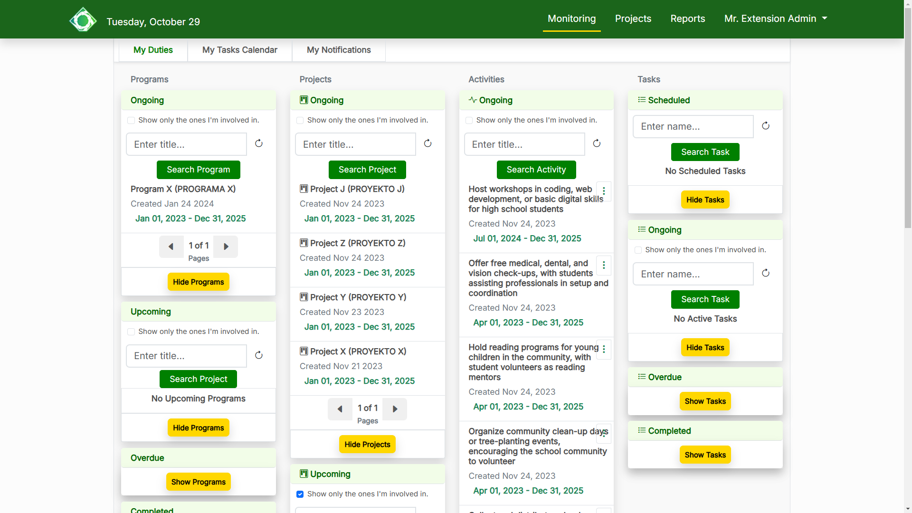
<h3><b>Program Selection Page</b></h3>

Users can explore programs within their specific departments or choose a more comprehensive view by accessing programs encompassing all departments

Also, users can add new program

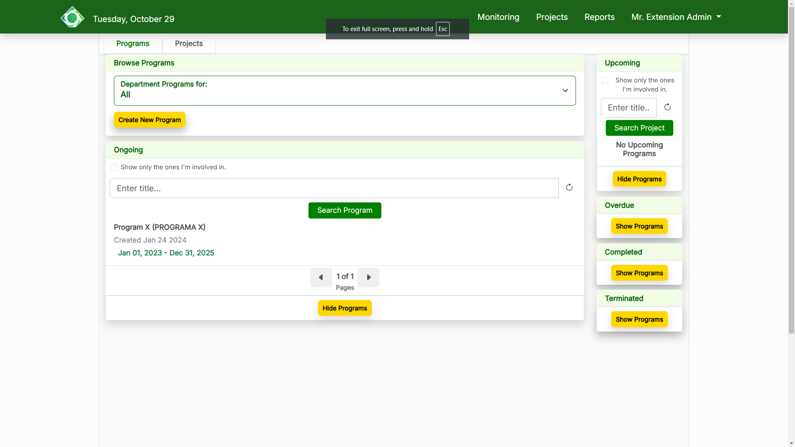
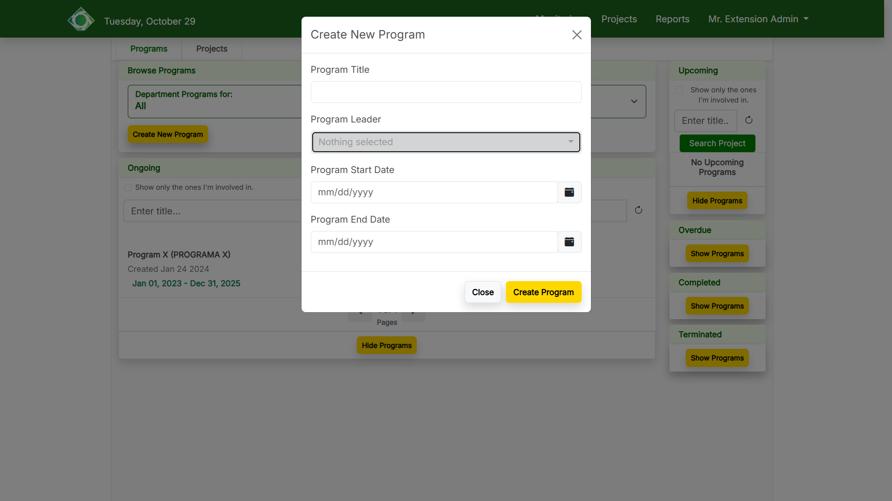
<h3><b>Project Selection Page</b></h3>

Users can explore projects within their respective departments or opt for a broader perspective by accessing projects involving all departments

Also, users can add new project which user can select which program it is.Then, user can list objectives.

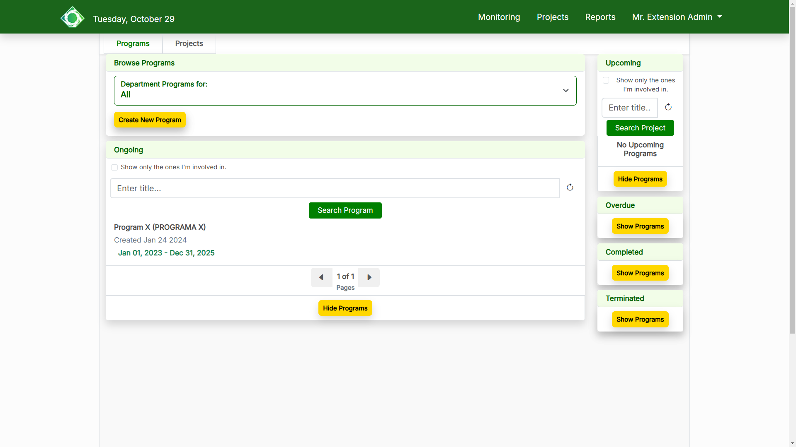
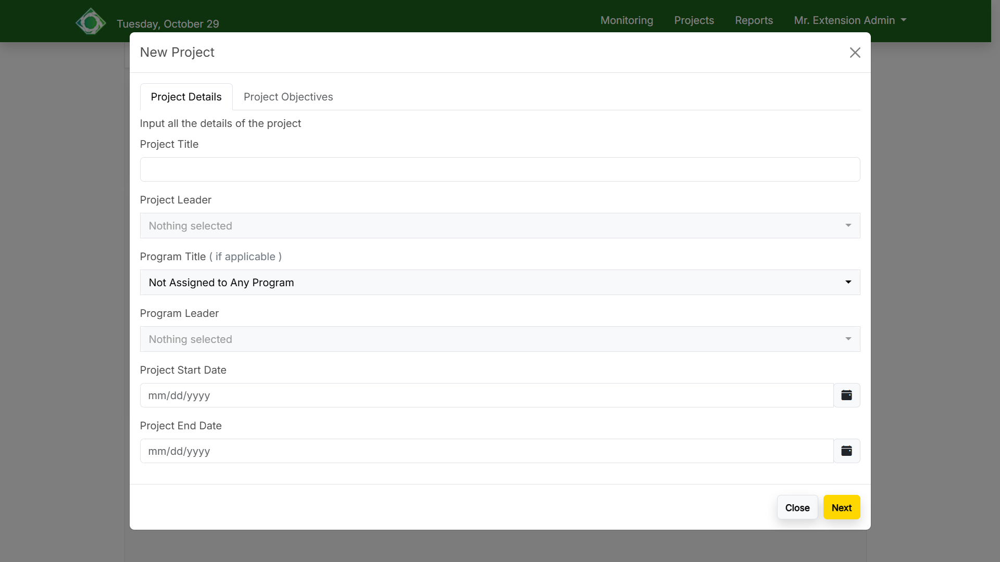
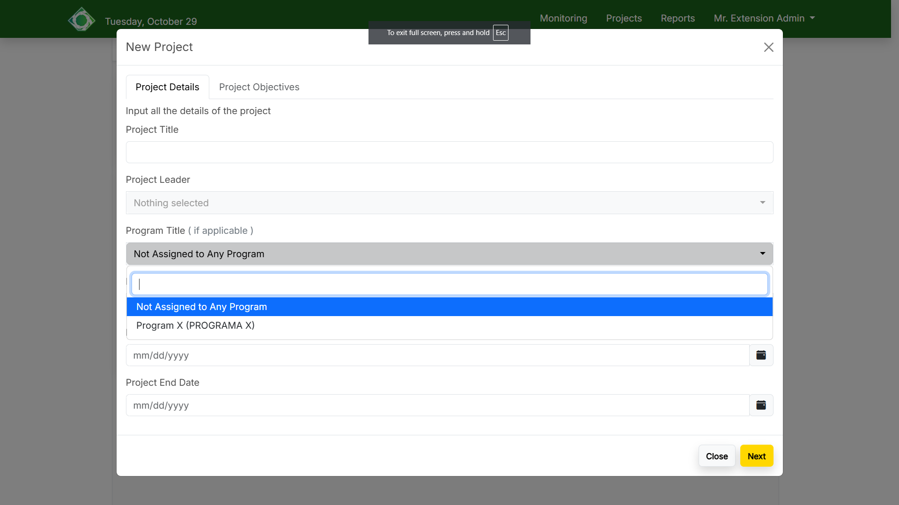
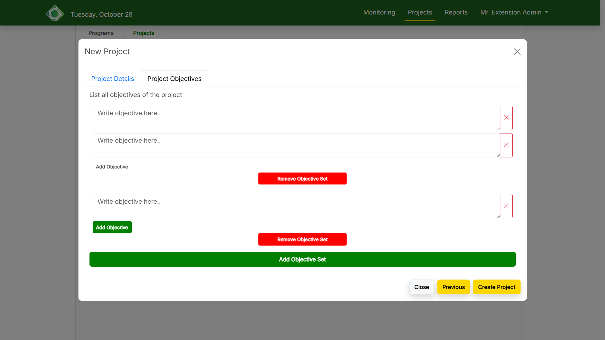
<h3><b>Project Page</b></h3>

Project Page includes the ability to navigate a comprehensive table presenting project details encompassing objectives, activities, expected output, activities’ duration, budget, and funding sources. 

Also, a menu unveils a curated selection of options.

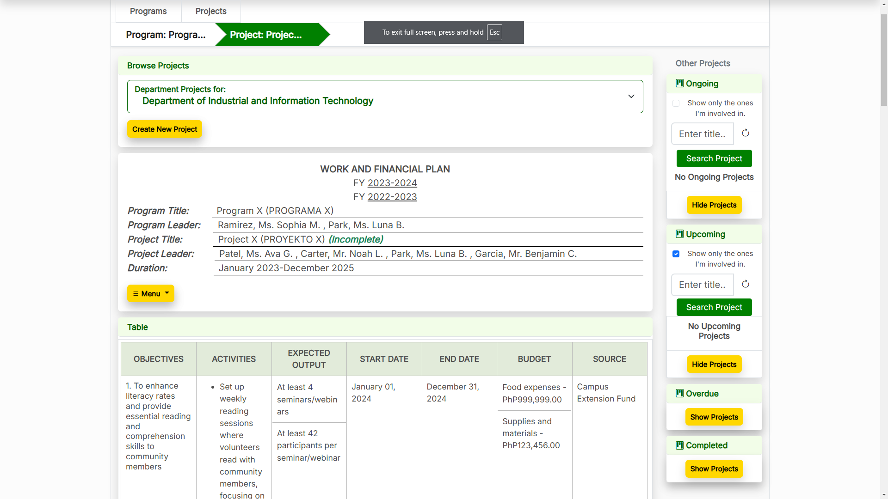
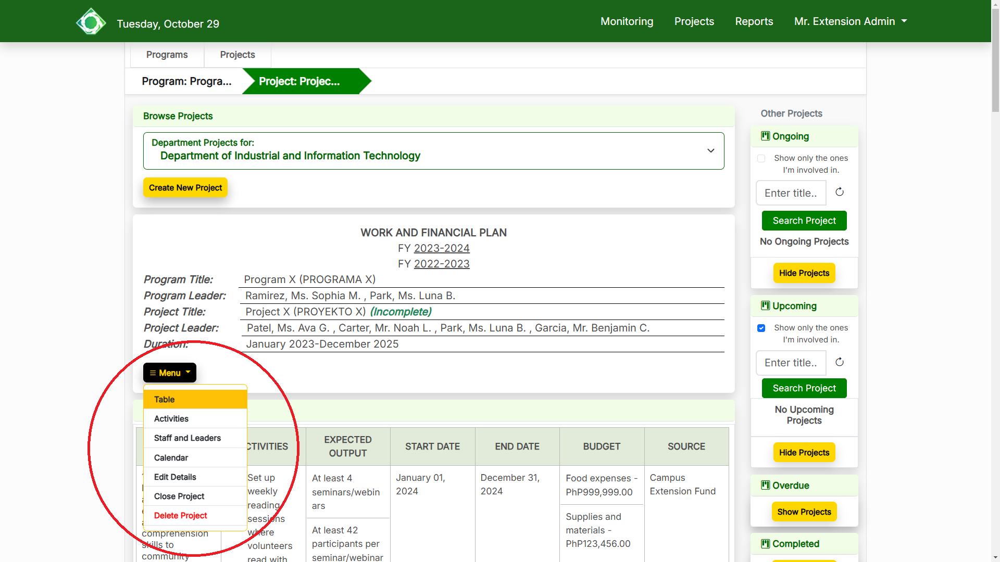
<h3><b>Activity Page</b></h3>

In an activity panel, users can see its details, outputs, assigned implementers, subtasks, and the other activities within the project. 

The activity interface also has a menu for administrators that unveils a curated selection of options that edit details, close activity, and delete activity. User can also add output, subtask, implementers for selected activity

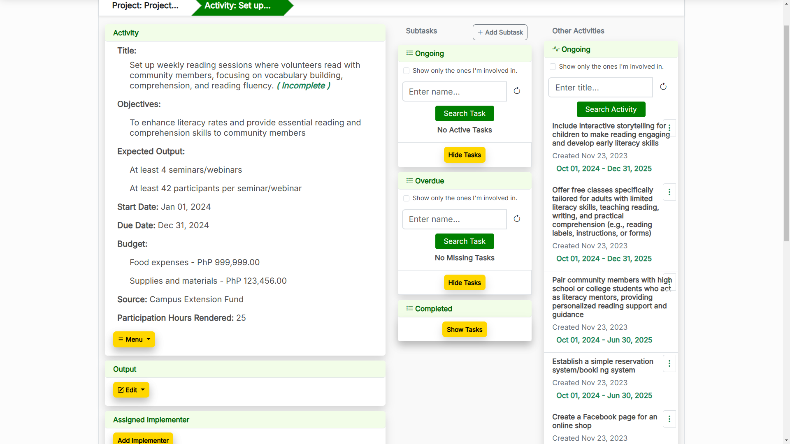
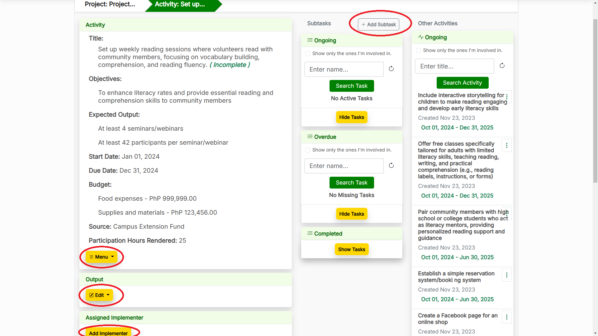
<h3><b>Subtask Page</b></h3>

In a subtask panel, users can see its details, assignees and the other subtasks within its activity. 

The subtask interface also has a menu for marking it as completed, edit details, delete subtask and submit accomplishment report for it

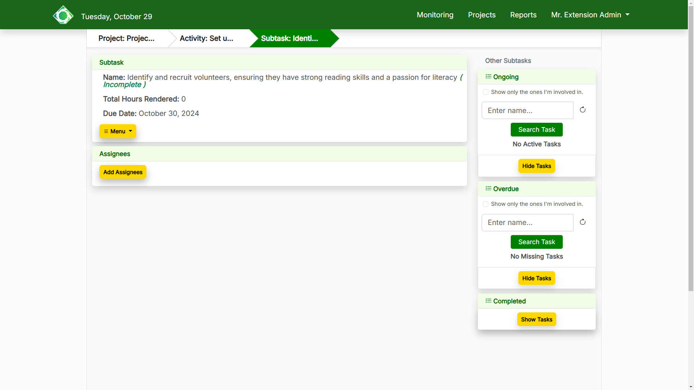
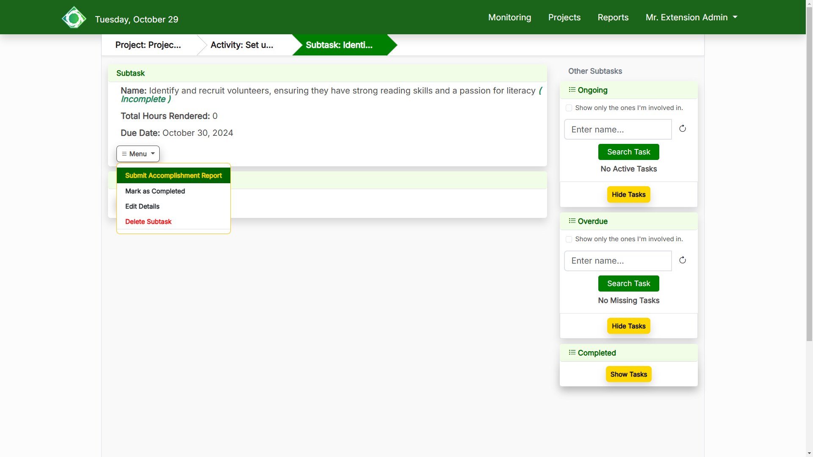

