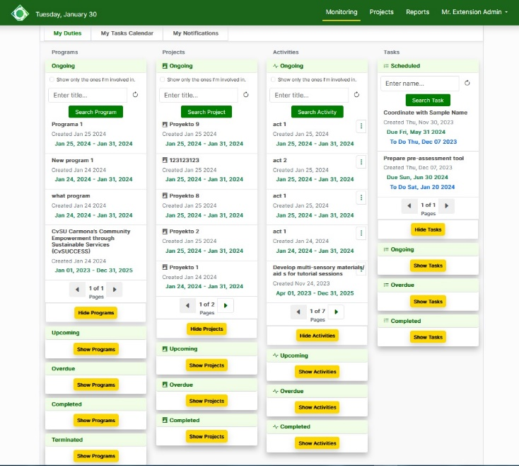
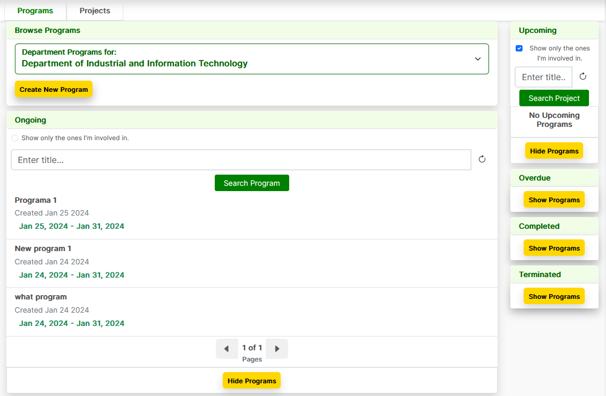
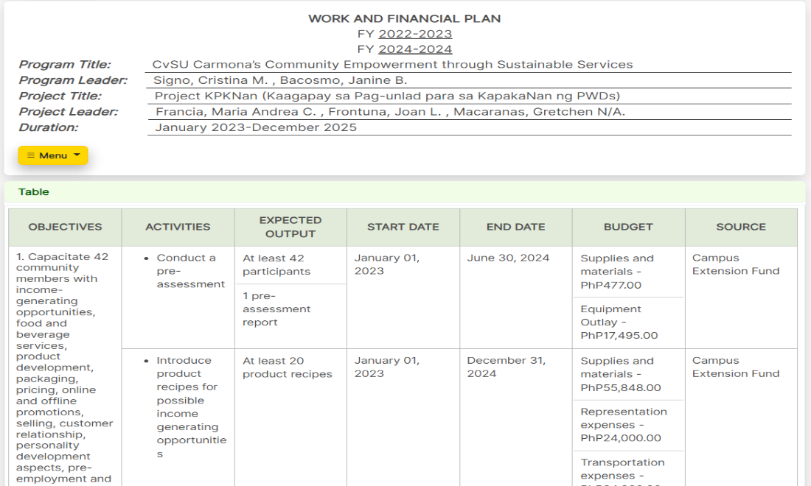
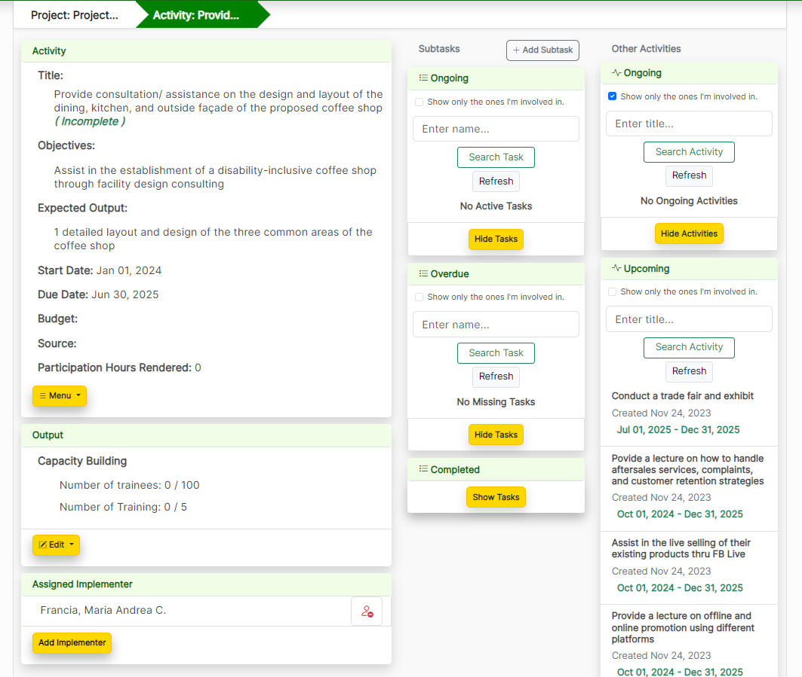
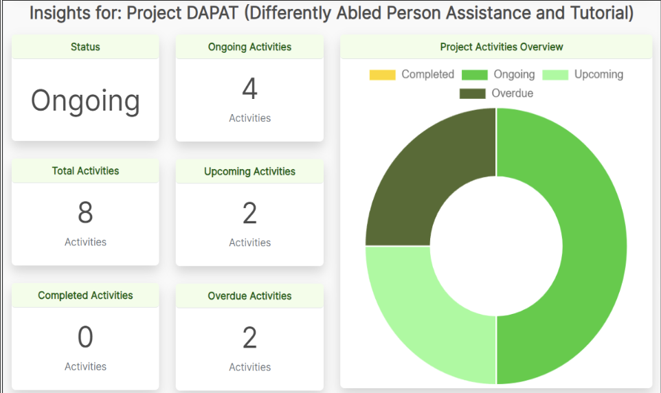
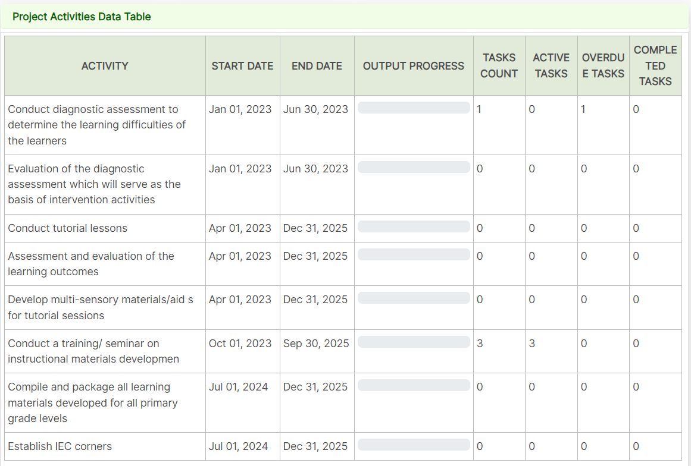
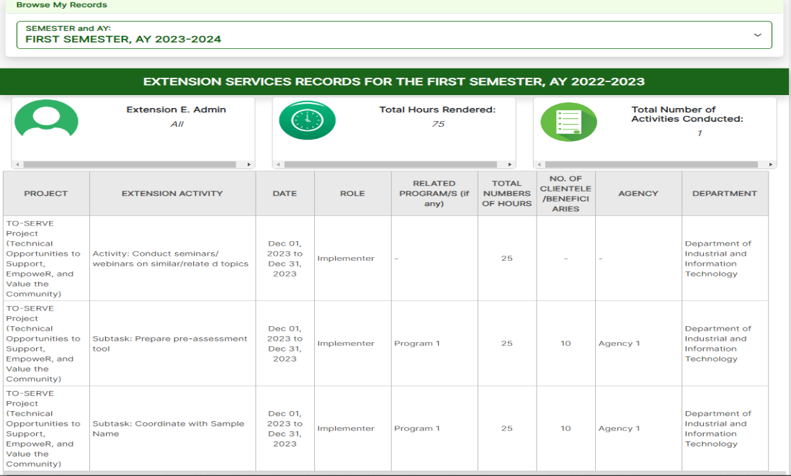

<h1><b>WEB-BASED PROJECT MANAGEMENT SYSTEM FOR THE EXTENSION SERVICES OFFICE OF CAVITE STATE UNIVERSITY - CARMONA</b></h1>
<h2><b>Software Description of the Web Application</b></h2>

The Web-based Project Management System for the Extension Service Office of Cavite State University (CvSU) – Carmona efficiently handles programs, projects, activities, and subtasks, emphasizing a minimalist design with color schemes reflecting the institution’s identity – green, yellow, and white. It is a strategic solution to enhance project management processes, promoting transparency, efficiency, and collaborative synergy. The user interface is designed for intuitiveness, facilitating seamless navigation and minimizing the learning curve for users.

<h3><b>
    Task Monitoring Page
</b></h3>

<h3><b>
    Program Page
</b></h3>

<h3><b>
    Project Page
</b></h3>

<h3><b>
    Work and Financial Page
</b></h3>

<h3><b>
    Activity Page
</b></h3>

<h3><b>
    Overview of the Reports Tab
</b></h3>

<h3><b>
   Project Activities Data Table
</b></h3>

<h3><b>
   Records Section
</b></h3>
