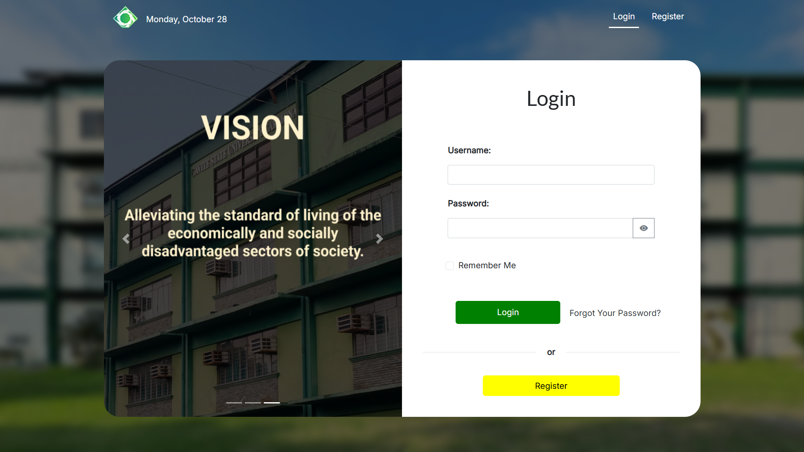

<h1><b>WEB-BASED PROJECT MANAGEMENT SYSTEM FOR THE EXTENSION SERVICES OFFICE OF CAVITE STATE UNIVERSITY - CARMONA</b></h1>
<h2><b>Software Description of the Web Application</b></h2>

The Web-based Project Management System for the Extension Service Office of Cavite State University (CvSU) – Carmona tracks faculty activities, records work hours, and highlights any missing hours. It also identifies participants in each task, makes it easy to generate records, and securely stores activity reports for coordinators. Built with Laravel, the app uses PHP for backend functions, HTML, CSS, Bootstrap 5 for design, JavaScript for interactivity, and MySQL for database management, developed in Visual Studio Code.

<h3><b>
    Login Page
</b></h3>

